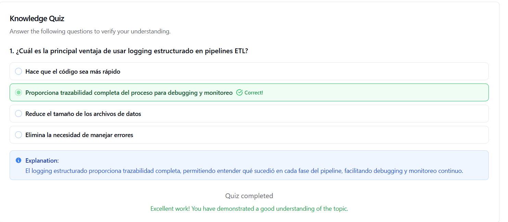

# Pipeline ETL Robusto con Manejo de Errores y Logging

Pipeline ETL (Extract, Transform, Load) completo implementado en Python con manejo robusto de errores, reintentos automáticos, transacciones y logging estructurado.

| Autor            | Fecha        | Día |
|------------------|--------------|----------|
| **Carlos Vásquez** |28 Noviembre 2025 | 5|

# Pipeline ETL Robusto con Manejo de Errores y Logging

Pipeline ETL (Extract, Transform, Load) completo implementado en Python con manejo robusto de errores, reintentos automáticos, transacciones y logging estructurado.

## 📋 Tabla de Contenidos

- [Características](#-características)
- [Requisitos](#-requisitos)
- [Instalación](#-instalación)
- [Uso](#-uso)
- [Arquitectura del Pipeline](#️-arquitectura-del-pipeline)
- [Estructura de Archivos](#-estructura-de-archivos)
- [Configuración](#️-configuración)
- [Ejemplos](#-ejemplos)
- [Manejo de Errores](#️-manejo-de-errores)
- [Logs y Monitoreo](#-logs-y-monitoreo)
- [Solución de Problemas](#-solución-de-problemas)

## ✨ Características

- **Extracción con Reintentos**: Hasta 3 intentos automáticos con delays configurables
- **Validaciones Robustas**: Detección y manejo de datos nulos e inconsistencias
- **Transacciones ACID**: Soporte completo para rollback automático
- **Logging Estructurado**: Logs detallados en archivo y consola
- **Métricas de Rendimiento**: Seguimiento de duración, registros procesados y errores
- **Verificación Automática**: Validación de resultados post-ejecución

## 🔧 Requisitos

### Software Requerido

- Python 3.7 o superior
- Librerías estándar de Python (incluidas por defecto):
  - `pandas`
  - `sqlite3`
  - `logging`
  - `pathlib`

### Requisitos del Sistema

- 100 MB de espacio en disco (para logs y base de datos)
- Permisos de lectura/escritura en el directorio de ejecución

## 📥 Instalación

### Paso 1: Clonar o Descargar el Código

```bash
# Si está en un repositorio
git clone <url-del-repositorio>
cd pipeline-etl-robusto

# O simplemente descarga el archivo etl_pipeline.py
```

### Paso 2: Verificar Python

```bash
python --version
# Debe mostrar Python 3.7 o superior
```

### Paso 3: Instalar Dependencias (si es necesario)

```bash
# Pandas generalmente viene con Python, pero si no está:
pip install pandas
```

## 🚀 Uso

### Ejecución Básica

```bash
python etl_pipeline.py
```

### Ejecución con Verificación

El script ejecuta automáticamente:
1. El pipeline ETL completo
2. Verificación de registros cargados
3. Muestra de datos
4. Estadísticas por categoría

### Salida Esperada

```
============================================================
VERIFICACIÓN DE RESULTADOS
============================================================
Total de registros en BD: 100

Muestra de datos:
   id   valor categoria  valor_cuadrado categoria_normalizada
0   1    1.1         A           1.21                     A
1   2    2.2         B           4.84                     B
2   3    3.3         C          10.89                     C
3   4    4.4         A          19.36                     A
4   5    5.5         B          30.25                     B

Estadísticas por categoría:
  categoria_normalizada  cantidad  valor_promedio  valor_cuadrado_promedio
0                     A        34           56.10                      4205.61
1                     B        33           55.00                      4070.00
2                     C        33           54.45                      3982.25
============================================================
✓ Pipeline ejecutado y verificado exitosamente
✓ Revisa el archivo 'etl_pipeline.log' para ver los logs detallados
============================================================
```

## 🏗️ Arquitectura del Pipeline

### Flujo de Datos

```
┌─────────────────┐
│   EXTRACCIÓN    │  ← Reintentos automáticos (máx. 3)
│  (Extract)      │
└────────┬────────┘
         │
         ▼
┌─────────────────┐
│ TRANSFORMACIÓN  │  ← Validaciones y limpieza
│  (Transform)    │
└────────┬────────┘
         │
         ▼
┌─────────────────┐
│     CARGA       │  ← Transacciones ACID
│    (Load)       │
└────────┬────────┘
         │
         ▼
┌─────────────────┐
│   VERIFICACIÓN  │  ← Métricas y reportes
└─────────────────┘
```

### Componentes Principales

#### 1. **Configuración de Logging**
```python
logging.basicConfig(
    level=logging.INFO,
    format='%(asctime)s - %(name)s - %(levelname)s - %(message)s',
    handlers=[
        logging.FileHandler('etl_pipeline.log'),
        logging.StreamHandler()
    ]
)
```

#### 2. **Clase RobustETLPipeline**
- `__init__()`: Inicializa configuración y métricas
- `run_pipeline()`: Orquesta todo el proceso ETL
- `extract_with_retry()`: Extrae datos con reintentos
- `transform_with_validation()`: Transforma y valida datos
- `load_with_transaction()`: Carga datos con transacciones
- `report_success()`: Genera reporte de éxito
- `report_failure()`: Genera reporte de fallo

## 📁 Estructura de Archivos

```
proyecto/
│
├── etl_pipeline.py          # Script principal del pipeline
├── etl_pipeline.log         # Archivo de logs (generado)
├── etl_database.db          # Base de datos SQLite (generada)
└── README.md                # Este archivo
```

### Archivos Generados

- **etl_pipeline.log**: Contiene todos los logs del pipeline
- **etl_database.db**: Base de datos SQLite con la tabla `datos_transformados`

## ⚙️ Configuración

### Personalizar Parámetros

```python
# Cambiar ubicación de la base de datos
pipeline = RobustETLPipeline(db_path='mi_base_datos.db')

# Modificar reintentos en extract_with_retry()
max_retries = 5  # Cambiar de 3 a 5 reintentos

# Ajustar delay entre reintentos
time.sleep(2)  # Cambiar de 1 a 2 segundos
```

### Modificar Nivel de Logging

```python
# Para más detalle (DEBUG)
logging.basicConfig(level=logging.DEBUG, ...)

# Para menos detalle (WARNING)
logging.basicConfig(level=logging.WARNING, ...)
```

## 📚 Ejemplos

### Ejemplo 1: Personalizar Fuente de Datos

```python
def extract_with_retry(self):
    # Reemplazar datos de ejemplo con fuente real
    data = pd.read_csv('mi_archivo.csv')
    # o
    data = pd.read_sql('SELECT * FROM tabla', conexion)
    return data
```

### Ejemplo 2: Agregar Validación Custom

```python
def transform_with_validation(self, data):
    # ... código existente ...
    
    # Agregar validación personalizada
    if data['valor'].max() > 1000:
        self.logger.warning("Valores muy altos detectados")
    
    return data_clean
```

### Ejemplo 3: Modificar Estrategia de Carga

```python
def load_with_transaction(self, data):
    # En lugar de DELETE + INSERT, usar UPSERT
    conn.execute('''
        INSERT OR REPLACE INTO datos_transformados 
        VALUES (?, ?, ?, ?, ?)
    ''', data.values)
```

## ⚠️ Manejo de Errores

### Estrategias Implementadas

1. **Reintentos Automáticos**
   - 3 intentos por defecto
   - Delay de 1 segundo entre intentos
   - Log de cada intento

2. **Transacciones ACID**
   - BEGIN TRANSACTION explícito
   - COMMIT solo si todo es exitoso
   - ROLLBACK automático en errores

3. **Validaciones Múltiples**
   - Verificación de nulos
   - Validación de rangos
   - Chequeo de tipos de datos

### Tipos de Errores Manejados

- **Errores de Conexión**: Reintentos automáticos
- **Errores de Validación**: Log y excepción
- **Errores de Base de Datos**: Rollback automático
- **Errores Inesperados**: Captura y reporte completo

## 📊 Logs y Monitoreo

### Formato de Logs

```
2024-01-15 10:30:45,123 - etl_pipeline - INFO - === INICIANDO PIPELINE ETL ROBUSTO ===
2024-01-15 10:30:45,124 - etl_pipeline - INFO - Intento de extracción #1
2024-01-15 10:30:45,150 - etl_pipeline - INFO - ✓ Extracción exitosa: 100 registros
2024-01-15 10:30:45,151 - etl_pipeline - INFO - Iniciando transformación de datos
2024-01-15 10:30:45,175 - etl_pipeline - INFO - ✓ Transformación exitosa: 100 -> 100 registros
2024-01-15 10:30:45,176 - etl_pipeline - INFO - Iniciando carga a base de datos
2024-01-15 10:30:45,200 - etl_pipeline - INFO - ✓ Carga exitosa: 100 registros insertados
```

### Métricas Capturadas

- **Duración Total**: Tiempo de ejecución completo
- **Registros Procesados**: Cantidad de registros ETL
- **Errores Encontrados**: Contador de fallos
- **Intentos de Reintento**: Número de reintentos necesarios

### Consultar Logs

```bash
# Ver logs en tiempo real
tail -f etl_pipeline.log

# Buscar errores
grep ERROR etl_pipeline.log

# Buscar warnings
grep WARNING etl_pipeline.log
```

## 🔍 Solución de Problemas

### Problema: "Permission Denied" al crear archivos

**Solución**: Ejecuta con permisos adecuados o cambia el directorio
```bash
sudo python etl_pipeline.py
# o
cd ~/mi_directorio_con_permisos
python etl_pipeline.py
```

### Problema: "Database is locked"

**Solución**: Cierra otras conexiones a la base de datos
```python
# O aumenta el timeout
sqlite3.connect('etl_database.db', timeout=30)
```

### Problema: Módulo pandas no encontrado

**Solución**: Instala pandas
```bash
pip install pandas
```

### Problema: Reintentos insuficientes

**Solución**: Aumenta max_retries en el código
```python
max_retries = 5  # En lugar de 3
```

## 📈 Mejoras Futuras

- [ ] Soporte para múltiples fuentes de datos
- [ ] Configuración mediante archivo YAML/JSON
- [ ] Notificaciones por email en caso de fallo
- [ ] Dashboard de monitoreo en tiempo real
- [ ] Soporte para procesamiento en paralelo
- [ ] Integración con sistemas de alertas (Slack, Teams)

## 📄 Licencia

Este proyecto es de código abierto y está disponible para uso educativo y comercial.

## 🤝 Contribuciones

Las contribuciones son bienvenidas. Por favor:
1. Haz fork del proyecto
2. Crea una rama para tu feature
3. Commit tus cambios
4. Push a la rama
5. Abre un Pull Request

## 📧 Contacto

Para preguntas o soporte, abre un issue en el repositorio.

---

**Última actualización**: Noviembre 2024
**Versión**: 1.0.0

## Evidencia de Test



